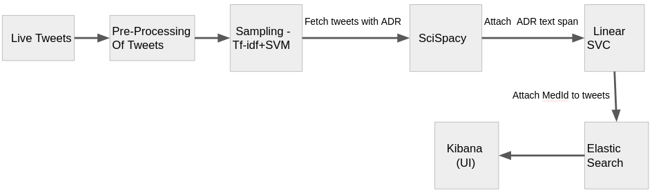
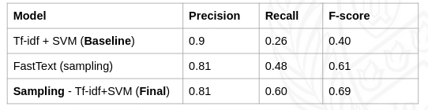
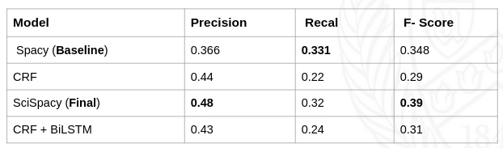
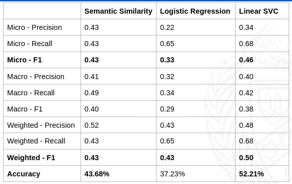
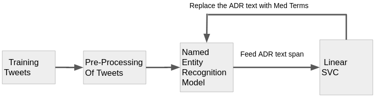

# Social Media Mining for Health Monitoring

Identifying and extracting ADRs from tweet if they exists and map to MedDRA ID. Also perform the same analysis on live tweets.

## Data Set

We took dataset from [#SMM4H](https://healthlanguageprocessing.org/smm4h-sharedtask-2020/) 2020 event.

## Pre-processing
Our preprocessing includes 
* Conversion of smilies to text    :-) => happy
* Conversion of general terms    em=> them 
* Removing hashtags   #trend => trend
* Removing punctuation
* Lemmatization using wordnet
* Word Tokenization
* Remove URLs present in the tweets
* Convert to Lowercase

## Pipeline

* We build a JSON data of Tweets.
* We used python flask as a backend server.
* We use Elasticsearch and Kibana to display the live tweets.

## TASK 1
* Binary classification task.
* Created tfidf vector representations of tweets and built SVM model on given dataset
* The dataset is highly imbalanced and skewed with a ratio of only 1 positive tweet out of 382.
* We Built FastText Supervised Training model.
* On this data, we implemented SVM and obtained an F-score of 0.69

## Task 2
* We did not remove any Stop Words as we want to improve the context.
* We used Spacy ‘en_core_web_sm’ model for our baseline system.
* We mapped the ADR label as mentioned in the dataset.
* To improve the context of the sentence, we included the drug name in the Tweet text. 
* Our motivation was, a drug causes similar Adverse Reactions on different consumers.

## Task 3
* Dataset used in this task is same as that of task 2. Here we used the extracted ADR, medterms to train and build our model.
* Baseline: We performed semantic textual similarity(cosine similarity) using sentence transformers(Multilingual sentence embeddings).
* We used pre-built bert model(bert-base-nli-mean-tokens) to convert terms to embeddings.
* We also built logistic regression and linear SVC models for task 3.
* We used TF-IDF to convert extracted ADRs to vectors for LR and SVC models and mapped each unique meddra-term to an id(0, 1, 2…).

## Report
[PDF](https://docs.google.com/document/d/1MsC_TiyaiPtOkN6vuUVHKHIiae_LtSjnXLVoaiF5AyI/edit?usp=sharing)

## New Approach

## Acknowledgements
We are extremely grateful to Professor [Rohini Srihari](https://engineering.buffalo.edu/computer-science-engineering/people/faculty-directory/rohini-srihari.html) for elucidating all the necessary concepts related to Natural Language Processing. We also thank TA, Archita Pathak for her efforts taken in clearing our doubts.

